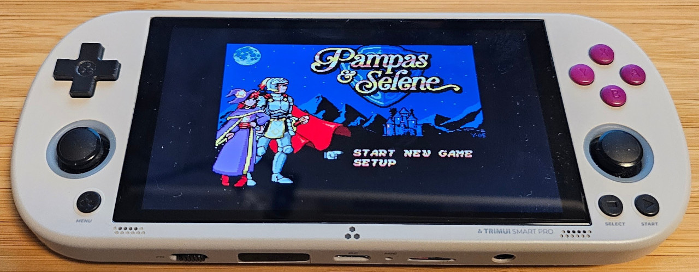

# openMSX for Trimui Smart Pro

 

### How to get your console
Please use these affiliate links when buying your Trimui to support me!  
[Trimui Smart Pro](https://s.click.aliexpress.com/e/_DC7NNMZ)

Accessories for Trimui Smart Pro  
[Protective Bag](https://s.click.aliexpress.com/e/_DnKA17f)  
[Screen Protector](https://s.click.aliexpress.com/e/_DCqp3jf)  
[Silicon Case](https://s.click.aliexpress.com/e/_Dk2vuOp)  
[Thumb Grip](https://s.click.aliexpress.com/e/_Dm0gxmz)

### How to install
IMPORTANT: You must have [Crossmix OS](https://github.com/cizia64/CrossMix-OS) installed to use openMSX. Save yourself some headache by using a branded SDCARD of good quality and not the noname card that you may get when buying the device.

Extract the openMSX release archive in the "Emus" folder on the SDCARD. Run the "EmuCleaner" App after installation.

### How to use
Select a game in the MSX or MSX2 category and press the X button. This brings up a menu where you can select diffrent configurations.

Button mapping in openMSX

MENU - Open the Main Menu.  
START - Show/Hide the On-screen Keyboard.  
SELECT - Toggle 50/60 Hz (MSX2+/Turbo R only).  
B - Primary fire.  
A - Secondary fire.  
Y - Enable auto-fire (Turbo R only).  
X - Diable auto-fire (Turbo R only).  
R1 - Quick save state.  
L1 - Quick load state.  
R2/L2 - Toggle Show FPS.

NOTE: For the game [Pampas & Selene](https://www.unepicfran.com/en/msx_pampas.html) use "openMsx (C-Bios MSX2+)" with the file "pampas_e.rom" to automatically apply the needed configuration.

NOTE: Running Turbo R requires system roms to be installed. These will be automatically downloaded the first time you run Turbo R if you are connected to wifi.

### How to build
You need Linux to build.  
Install the [patched SDK](https://github.com/pthalin/SDK_Trimui_Smart_Pro)  
Run "source build.sh" in the top dir.

Donation using [Ko-Fi](https://ko-fi.com/patriksretrotech) or [PayPal](https://www.paypal.com/donate/?business=UCTJFD6L7UYFL&no_recurring=0&item_name=Please+support+me%21&currency_code=SEK) are highly appreciated!

This is a based on [https://github.com/openMSX/openMSX](https://github.com/openMSX/openMSX).
A big thank you to the developers of openMSX for making this awsome emulator and providing support so I could comple this. 